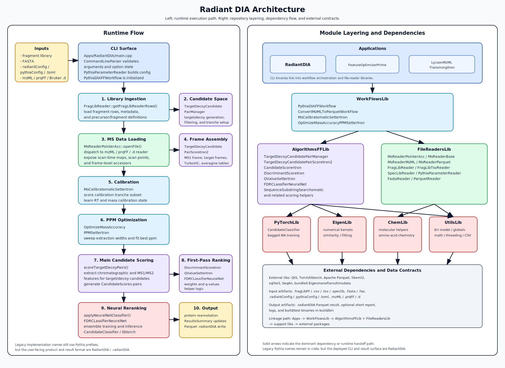

# Radiant DIA Architecture

This document complements the algorithm overview with a codebase-oriented architecture view. It covers both the runtime execution path and the compile-time module layering used by the repository.

## Reading Guide

The diagram is split into two panels:

- **Runtime flow**: how inputs move through the `RadiantDIA` executable and the core workflow stages
- **Module layering**: how the repo is organized into apps, workflow orchestration, scoring/reader libraries, support libraries, and external dependencies

## Primary Runtime Path

The main end-to-end entry point is `Apps/RadiantDIA/main.cpp`, which:

1. validates CLI arguments through `CommandLineParser`
2. parses config into `PythiaParameters`
3. initializes `PythiaDIAFFWorkflow`
4. calls `processFile()` on the MS input

Inside `PythiaDIAFFWorkflow`, the run proceeds through these major stages:

1. **Library ingestion**
   - `FragLibReader::getFragLibReaderRows()`
   - `TargetDecoyCandidatePairManager::init()`
2. **MS data loading**
   - `MsReaderPointerAcc::openFile()`
   - `TargetDecoyCandidatePairScoretron2::init()`
3. **Calibration**
   - `MsCalibratomaticSettertron::buildCalibration()`
4. **PPM optimization**
   - `OptimizeMassAccuracyPPMSettertron::initExec()`
5. **Main scoring**
   - `TargetDecoyCandidatePairScoretron2::scoreTargetDecoyPairs()`
   - `PythiaDIAFFWorkflowSharedMethods::processBatch()`
6. **Neural-network reranking**
   - `applyNeuralNetClassifier()`
   - `FDRCLassifierNeuralNet`
   - `CandidateClassifier`
7. **Annotation and reporting**
   - `updateProteinGroupAnnotation()`
   - `writePythiaDIA()`

## Module Roles

### Apps

- `RadiantDIA`: primary DIA search CLI
- `LycaonMzMLTransmorgitron`: mzML-to-Parquet conversion CLI
- `FeatureOptimizerPrime`: feature/parameter optimization CLI

### WorkFlowsLib

`WorkFlowsLib` is the orchestration layer. It owns the end-to-end sequencing of:

- initialization
- calibration
- tolerance optimization
- scoring
- reranking
- annotation
- output writing

The primary classes are:

- `PythiaDIAFFWorkflow`
- `ConvertMzMLToParquetWorkFlow`
- `MsCalibratomaticSettertron`
- `OptimizeMassAccuracyPPMSettertron`
- `PythiaDIAFFWorkflowSharedMethods`

### AlgorithmsFFLib

`AlgorithmsFFLib` contains the core computational logic:

- target/decoy candidate construction
- chromatogram extraction and frame processing
- candidate scoring
- linear discriminant scoring
- q-value assignment
- neural-network FDR utilities
- peptide-to-protein annotation support

This is the densest logic layer in the repository.

### FileReadersLib

`FileReadersLib` is the I/O and format layer:

- config parsing
- FASTA parsing
- fragment-library reading
- mzML and Parquet reading
- Parquet writing
- reader abstraction through `MsReaderPointerAcc`

### Support Libraries

- `PyTorchLib`: wraps libtorch model training/inference via `CandidateClassifier`
- `EigenLib`: numerical kernels, vector/matrix operations, fitting, similarity metrics
- `ChemLib`: molecular and amino-acid chemistry helpers
- `UtilsLib`: error handling, utility math, CSV helpers, global constants, threading helpers

## Build-Time Dependency Shape

At the CMake level, the project is layered as follows:

- `RadiantDIA` links `WorkFlowsLib`, `FileReadersLib`, and `UtilsLib`
- `WorkFlowsLib` links `AlgorithmsFFLib`, `EigenLib`, `FileReadersLib`, and `UtilsLib`
- `AlgorithmsFFLib` links `ChemLib`, `EigenLib`, `FileReadersLib`, `PyTorchLib`, and `UtilsLib`
- `FileReadersLib` links `ChemLib`, `EigenLib`, `UtilsLib`, Parquet, libxml2, and sqlite3
- `PyTorchLib` links `UtilsLib` plus Torch/libtorch

This produces a clean separation:

- **Apps** own the CLI surface
- **WorkFlowsLib** owns orchestration
- **AlgorithmsFFLib** owns scoring and modeling logic
- **FileReadersLib** owns file-format adaptation
- **Support libs** own math, ML, chemistry, and utility behavior

## Runtime Data Contracts

### Inputs

The main search executable consumes:

- fragment library: `.fragLibFF`, `.csv`, `.tsv`, `.speclib`
- FASTA: `.fasta`, `.fas`
- config: `.radiantConfig`, legacy `.pythiaConfig`, or `.toml`
- MS data: `.prqFF`, `.mzML`, or Bruker `.d`

### Outputs

The main result artifact is:

- `.radiantDIA` Parquet output

Additional runtime artifacts may include:

- console logs with calibration/FDR summaries
- intermediate test or dev-only Parquet outputs when compile-time debug blocks are enabled

## Naming Caveat

The codebase still carries substantial legacy `Pythia` naming:

- `PythiaDIAFFWorkflow`
- `PythiaParameters`
- `writePythiaDIA()` helper naming

But the product-facing executable and result format are `RadiantDIA` and `.radiantDIA`. Any external documentation should treat the `Pythia*` names as legacy implementation names rather than the current product boundary.

## Current Operational Caveat

In the current code, calibration failure is logged as recoverable, but later stages can still depend on calibration-derived state. That means a run can begin normally, read inputs successfully, and still terminate before emitting a `.radiantDIA` file if calibration and/or downstream candidate scoring do not produce enough confident matches.

This is relevant for onboarding: not every bundled test fixture should be assumed to be a guaranteed successful end-to-end example.
